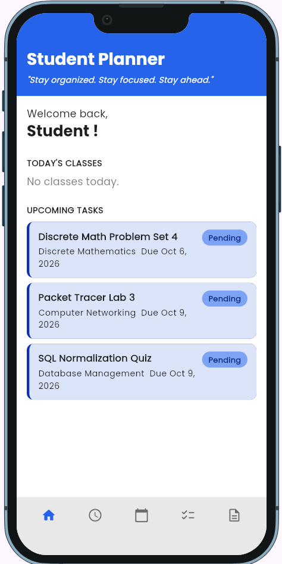
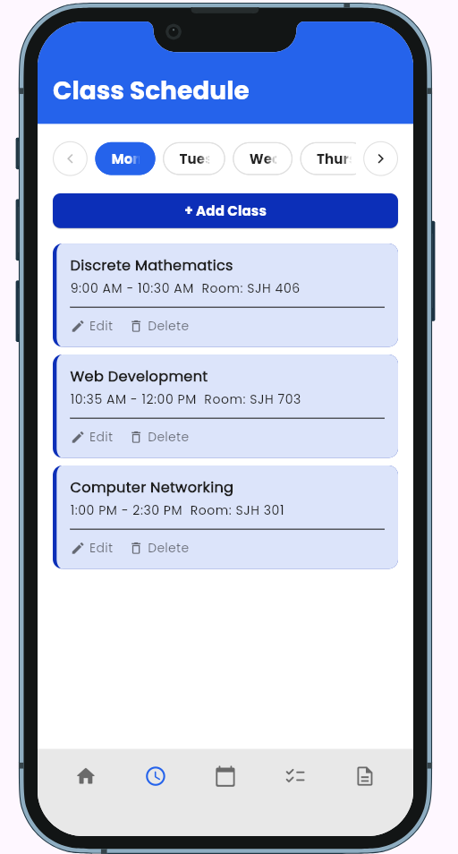

<!--
  This is your project's front page. Replace every placeholder below.
  It is the first thing your instructor and any future employer will read, and
  the live link in it is how your project gets opened for grading.

  New here? Read START-HERE.md first. Delete this comment when you are done.
-->

# Student Planner

> A student planner that brings class schedules, tasks, deadlines, calendar events, and notes together in one place, helping students stay organized, remember important schoolwork, and avoid missing deadlines.

**Live demo:** https:https://pblogs1112.github.io/StudentPlanner_Website/ <!-- GitHub Pages is set up already; replace if you host elsewhere -->
**Demo video:** `docs/demo.mp4` (link it here once it exists)
**Course:** Applications Development and Emerging Technologies (6ADET), Holy Angel University
**Author:** Philbert Logatoc

This repository lives in the author's own GitHub account and is public on
purpose. There is no `student.json` here and there should not be one: see
`docs/06-security-and-privacy.md` for what a public repo means for secrets and
personal data.

---

## Screenshots

Put two or three real screenshots at phone size in `docs/assets/`, then replace
this paragraph with them:

```markdown
| Home | Detail | Add |
| --- | --- | --- |
|  |  |  |
| State | `setState` for local UI state + `PlannerStore` (`ChangeNotifier`) for shared app state|
| Storage | shared_preferences |
| Other packages | `google_fonts` for the Poppins font; `device_preview` for testing the phone layout in Chrome |

## Running it yourself

```bash
flutter pub get
flutter run -d chrome --web-port 8080
```

Then open http://localhost:8080. Requires Flutter (run `flutter --version` and
Flutter 3.44.8).

### Environment variables

This project does not use environment variables, API keys, or external backend services.
The app uses shared_preferences for local storage.

## Privacy and secrets

Required section. Two or three honest sentences:

The app stores classes, tasks, and notes locally on the user's device using `shared_preferences`, and this data does not leave the device or get sent to an external service. The project does not use API keys, `.env` files, or other secrets. All sample data, screenshots, and the demo video contain no real personal information.

## Project documentation

| Document | |
| --- | --- |
| [Proposal](docs/01-proposal.md) | the problem, the users, the scope |
| [Mockup and wireframes](docs/02-mockup.md) | what it looks like, and the screen flow |
| [Design system](docs/03-design-system.md) | colors, type, spacing, components |
| [Weekly reports](docs/04-weekly-reports.md) | what happened each week |
| [Demo video](docs/05-demo-video.md) | the recording and what it shows |
| [Start here](START-HERE.md) | how this repo works (delete once you have read it) |
| [Security and privacy](docs/06-security-and-privacy.md) | the checklist, filled in |

## Status and what is next

The main features of the Student Planner are working, including the Dashboard, Class Schedule, Calendar, Tasks, Notes, shared app state, and local data persistence.
Future improvements I plan to implement include notifications for upcoming classes and tasks, better offline access, a dark mode, and search and filter features to make the planner easier to use.

## Credits

- Packages: see `pubspec.yaml`
- Assets, icons, 3D models, sounds: name the author and the licence for each
- People who helped, and how

## AI use

This section is the last 10 points of the finals badge, and it wants three
things:

[](AI-USAGE.md)

**AI assistance:** Claude was used extensively to help with implementation, debugging, and improving parts of the Student Planner app.

See [AI-USAGE.md](AI-USAGE.md) for the complete AI usage log and details of what was kept or changed.

## Licence

MIT, see [LICENSE](LICENSE). Change it if you want different terms.
